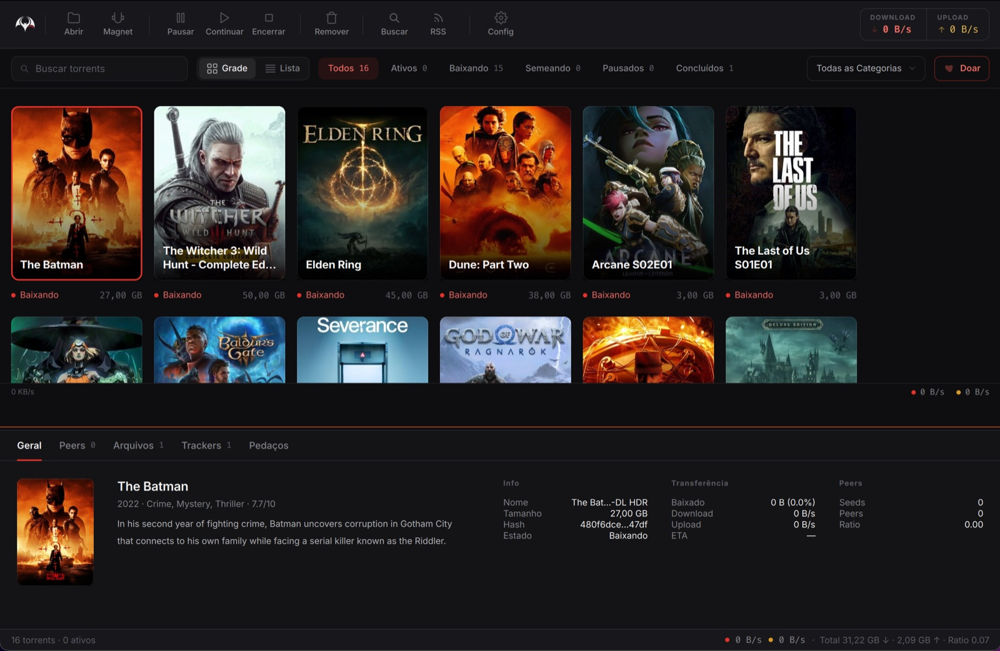
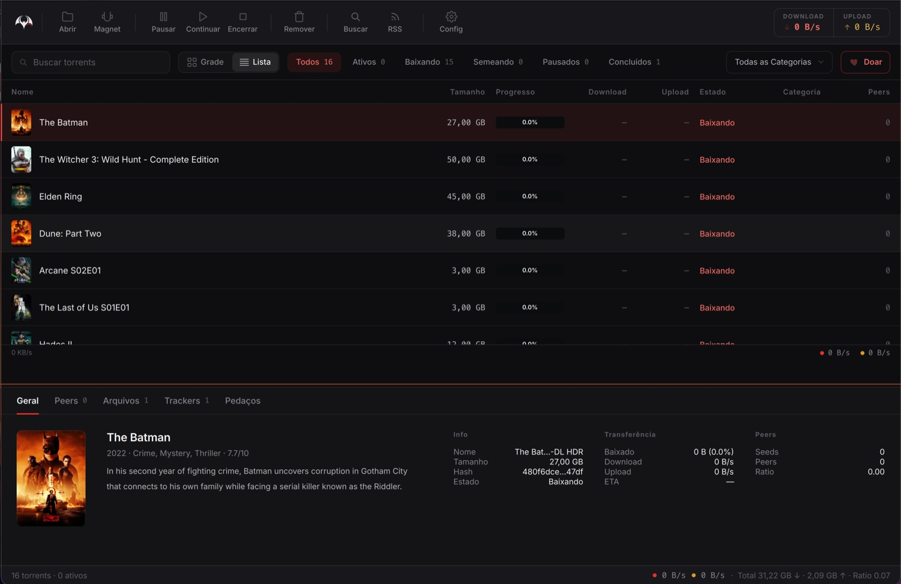
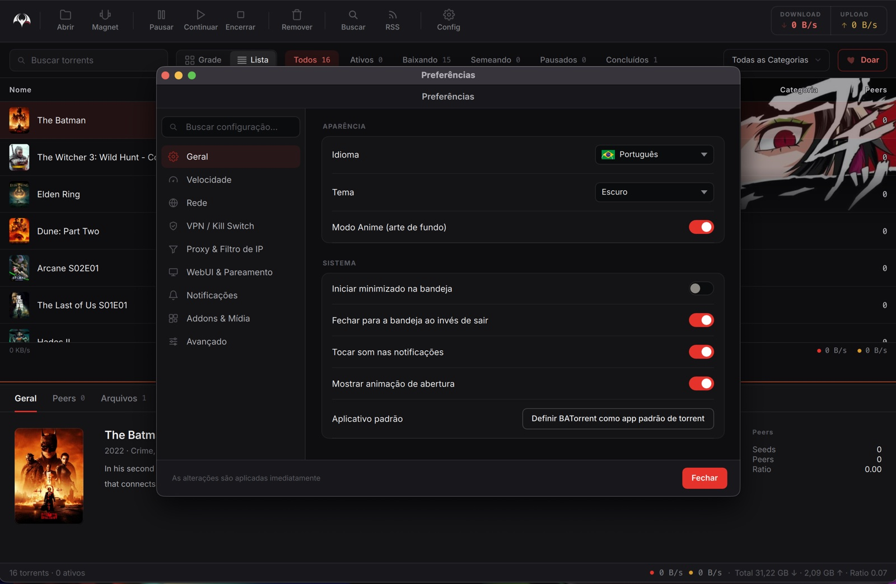

<p align="center">
  <a href="README.md">English</a> | <b>Português</b> | <a href="README.zh-CN.md">中文</a> | <a href="README.ja.md">日本語</a> | <a href="README.ru.md">Русский</a> | <a href="README.es.md">Español</a> | <a href="README.de.md">Deutsch</a> | <a href="README.ua.md">Українська</a>
</p>

<p align="center">
  
</p>

<h1 align="center">BATorrent</h1>

<p align="center">
  <i>O cliente BitTorrent com cara — capas de filme, seis temas, zero anúncios.</i>
</p>

<p align="center">
  <a href="https://github.com/Mateuscruz19/BATorrent/releases/latest"></a>
  <a href="https://github.com/Mateuscruz19/BATorrent/releases"></a>
  <a href="LICENSE"></a>
  
  <a href="https://apps.microsoft.com/detail/9n4l3tq24rc6"></a>
</p>


<p align="center">
  
</p>

A maioria dos clientes de torrent parece uma declaração de imposto de renda. Este aqui mostra seus downloads como uma **parede de capas de filmes, séries e jogos** — a mesma coisa que você reconhece na Netflix ou na Steam — e deixa você vesti-lo com seis temas (ou seu próprio papel de parede). Por baixo do capô é a consagrada engine **libtorrent**, então não é um brinquedo bonitinho: é um cliente de verdade que por acaso tem bom gosto.

> **Sem anúncios. Sem telemetria. Sem versão "Pro". Sem conta.** A única requisição que ele faz sozinho é a checagem de atualização no GitHub, e dá pra desligar. O código está bem aqui — leia o [`updater.cpp`](src/app/updater.cpp) e confira você mesmo.


## Por que isto existe

Sou um desenvolvedor sozinho no Brasil. Eu queria um cliente de torrent que levasse privacidade a sério, rodasse nativamente em todo desktop e não parecesse ter sido feito em 2009 — e como não achei nenhum, criei o meu. É grátis e **licenciado sob a MIT**: sem pegadinhas, sem telemetria aparecendo depois e sem poder ser vendido caladinho para uma empresa que enfia anúncios. Oito idiomas, porque "útil" não devia significar "só em inglês".

## O visual

<p align="center">
  
</p>

<p align="center">
  
</p>

<p align="center">
  
  
</p>

- **Capa automática** — ele lê o nome do torrent e busca o pôster real (filmes e séries via TMDB, jogos via IGDB) numa visão em grade. Um clique alterna para uma lista compacta.
- **Seis temas** — Dark, Light, Midnight, Sakura, Dark Star e um totalmente **Personalizado** (seu próprio fundo + cores de destaque), cada um com arte de destaque anime opcional.
- Gráfico de velocidade em tempo real, progresso colorido por estado, um popup de bandeja rico com velocidades ao vivo e ETA — os detalhes que fazem ele *parecer* acabado.

## O que ele faz de verdade

| | |
|---|---|
| 🔒 **Privacidade em primeiro lugar** | Vínculo à interface da VPN + **kill switch** (corta todo o tráfego se o túnel cair), modo PT para trackers privados, preset Tor, handshake anônimo, bloqueio anti-leecher |
| 🔎 **Achar e adicionar** | Busca embutida (inclui fontes abertas CIS/RuTor, sem login), Colar Inteligente (magnet / `thunder://` / hash no Ctrl+V), download automático por RSS com filtros regex, arrastar e soltar |
| 📱 **Controle de qualquer lugar** | WebUI no navegador com **pareamento por QR** — escaneie do celular, sem digitar IP. O QR é gerado localmente; seu endereço nunca sai da máquina |
| 📺 **Assistir e organizar** | Assista enquanto baixa, extração automática de arquivos, categorias + tags, atualização da biblioteca Plex/Jellyfin/Emby ao concluir |
| 🔔 **Fique por dentro** | Notificações nativas do desktop, alertas no Telegram, Discord Rich Presence ("Baixando X · 67%") |

<details>
<summary><b>…e a cauda longa</b> (clique para expandir)</summary>

Prioridade por arquivo · download sequencial · injeção automática de trackers · controle de layout de conteúdo · regex de arquivos excluídos · pasta temporária de download · estado Concluído com janelas de seeding · auto-pausa em erro de arquivo · limites globais + por torrent de ratio/tempo · agendador de banda (hora + dia) · importar do qBittorrent · criar arquivos `.torrent` · inspetor de torrent · listas de bloqueio de IP · criptografia de protocolo · mirror de atualização Gitee · desligamento automático ao terminar · exclusão no Windows Defender · backup/restauração completos · histórico de removidos recentemente · forçar início · visualizador de log embutido + diagnósticos + teste de vazamento de IP · formatação por localidade · atalhos de teclado.

</details>


## Baixar

| Plataforma | | |
|---|---|---|
| **Windows** | [Microsoft Store](https://apps.microsoft.com/detail/9n4l3tq24rc6) · [Instalador](https://github.com/Mateuscruz19/BATorrent/releases/latest) · [Portátil](https://github.com/Mateuscruz19/BATorrent/releases/latest) | Windows 10+ |
| **macOS** | **`brew install --cask Mateuscruz19/batorrent/batorrent`** · [`.dmg`](https://github.com/Mateuscruz19/BATorrent/releases/latest) | macOS 12+ · Apple Silicon |
| **Linux** | [AppImage](https://github.com/Mateuscruz19/BATorrent/releases/latest) | glibc 2.35+ |

Depois é só arrastar um `.torrent` ou magnet para a janela. Só isso.

<sub>**macOS:** ainda não notarizado (o programa de desenvolvedor da Apple é pago). O Homebrew é o caminho mais suave — o `brew` remove a flag de quarentena, então abre sem o aviso do Gatekeeper. Com o `.dmg`, clique com o botão direito → **Abrir** na primeira vez.</sub>


<details>
<summary><b>Compilar do código-fonte e notas de engenharia</b></summary>

### Requisitos
C++17 · CMake 3.16+ · Qt 6 (`Widgets`, `Network`, `Svg`, `Multimedia`) · libtorrent-rasterbar 2.0+ · Boost · Qt6Keychain (opcional).

```bash
# Debian / Ubuntu
sudo apt install build-essential cmake qt6-base-dev qt6-svg-dev qt6-multimedia-dev \
    libtorrent-rasterbar-dev libboost-dev libssl-dev
cmake -B build -DCMAKE_BUILD_TYPE=Release && cmake --build build -j && ./build/BATorrent
```
(macOS: `brew install qt libtorrent-rasterbar boost openssl`. Windows: instalador do Qt + `vcpkg install libtorrent:x64-windows`.)

### Qualidade e segurança

<p>
  <a href="https://github.com/Mateuscruz19/BATorrent/actions/workflows/codeql.yml"></a>
  <a href="https://github.com/Mateuscruz19/BATorrent/actions/workflows/sanitizers.yml"></a>
  <a href="https://sonarcloud.io/summary/new_code?id=Mateuscruz19_BAT-Torrent"></a>
  <a href="https://www.codefactor.io/repository/github/mateuscruz19/batorrent"></a>
  <a href="https://www.bestpractices.dev/projects/13073"></a>
</p>

- **Testes** — suíte Catch2 (unidade, segurança, memória) em todo build de CI; comportamento novo de backend ganha um teste.
- **Sanitizers** — passa limpo sob AddressSanitizer + UndefinedBehaviorSanitizer (0 vazamentos / use-after-free / UB).
- **Revisado** antes de cada release quanto a segurança de memória/threads, autenticação da WebUI, injeção, path traversal, validação de entrada e tratamento de segredos. Segredos ficam no keychain do sistema, nunca em texto puro; a WebUI só abre na rede depois que você define uma senha.

</details>

## Contribuindo

Issues e PRs são bem-vindos — para qualquer coisa não-trivial, abra uma issue antes. Relatos de bug: inclua sua plataforma + versão (`Ajuda → Sobre`) e os passos para reproduzir. Traduções são especialmente bem-vindas.

## Licença

[MIT](LICENSE) © 2024–2026 Mateus Cruz · feito no Brasil 🦇
