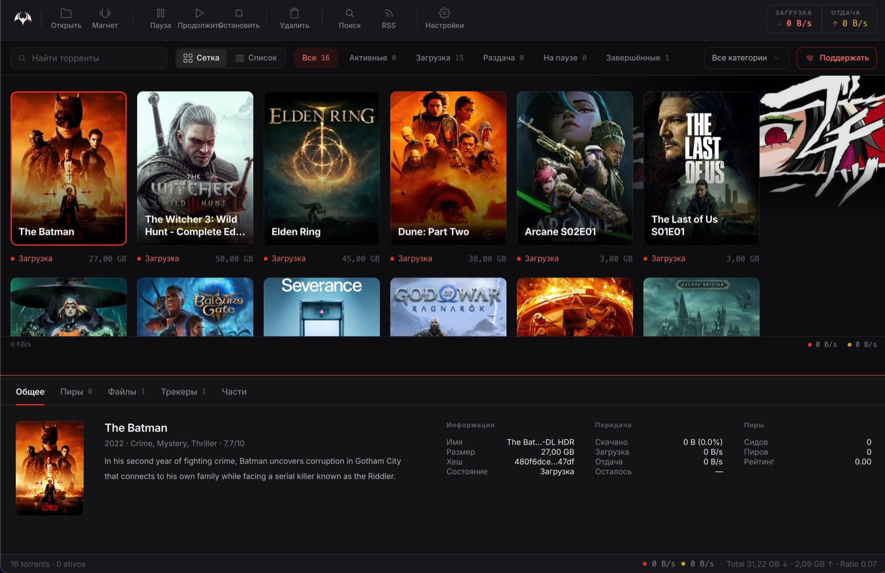
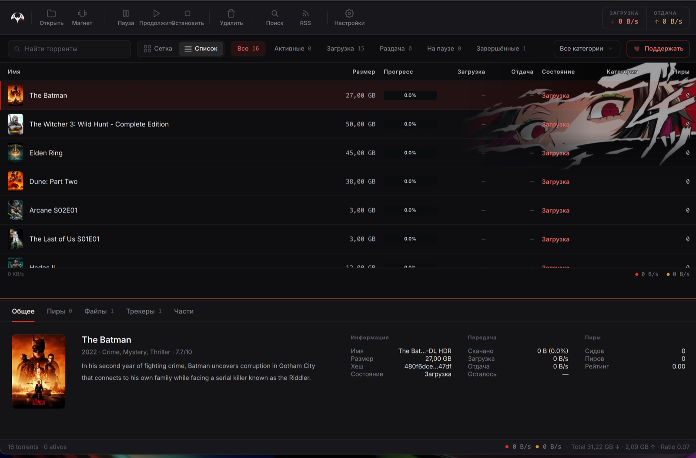
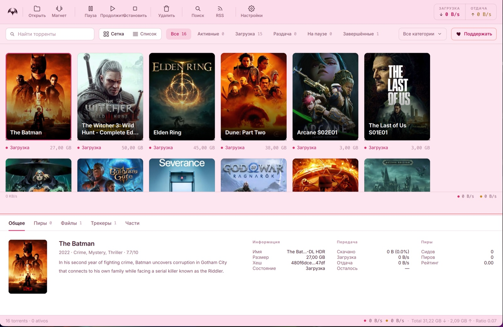

> [!IMPORTANT]
> **Это неофициальный форк.** Перед вами личный форк [**coex177**](https://github.com/coex177), а не официальный проект. Он следует за upstream и добавляет ряд исправлений и улучшений удобства (см. [Чем отличается этот форк](#чем-отличается-этот-форк)). Он не связан с автором оригинала и не поддерживается и не одобряется им.
>
> - **Оригинальный проект:** [BATorrent-app/BATorrent](https://github.com/BATorrent-app/BATorrent) от Mateus Cruz. Используйте его для официальных, кроссплатформенных, подписанных сборок (Microsoft Store / Homebrew / AppImage).
> - **Сборки этого форка:** [релизы coex177/BATorrent](https://github.com/coex177/BATorrent/releases), пока это **альфа только для Windows** (`v4.1.0a`).

<p align="center">
  <a href="README.md">English</a> | <a href="README.pt-BR.md">Português</a> | <a href="README.zh-CN.md">中文</a> | <a href="README.ja.md">日本語</a> | <b>Русский</b> | <a href="README.es.md">Español</a> | <a href="README.de.md">Deutsch</a> | <a href="README.ua.md">Українська</a>
</p>

<p align="center">
  
</p>

<h1 align="center">BATorrent</h1>

<p align="center">
  <i>Торрент-клиент с лицом — обложки фильмов, шесть тем, ноль рекламы.</i>
</p>

<p align="center">
  <a href="https://github.com/coex177/BATorrent/releases"></a>
  <a href="https://github.com/coex177/BATorrent/releases"></a>
  <a href="LICENSE"></a>
  
</p>


<p align="center">
  
</p>

Большинство торрент-клиентов выглядят как налоговая декларация. Этот показывает ваши загрузки **стеной обложек фильмов, сериалов и игр** — как на Netflix или в Steam — и позволяет нарядить его в шесть тем (или ваши собственные обои). Под капотом — проверенный движок **libtorrent**, так что это не красивая игрушка: это настоящий клиент, у которого просто оказался вкус.

> **Без рекламы. Без телеметрии. Без «Pro»-версии. Без аккаунта.** Единственный запрос, который он делает сам — проверка обновлений на GitHub, и её можно отключить. Исходный код прямо здесь — откройте [`updater.cpp`](src/app/updater.cpp) и убедитесь сами.


## Чем отличается этот форк

Этот форк основан на оригинальном BATorrent **v4.1.0** и добавляет набор исправлений и улучшений удобства. Всё, что ниже этого раздела, описывает оригинальное приложение и относится и к форку.

- **Переименование делает всё.** Переименование торрента теперь обновляет файл или папку на диске *и* имя, показанное в списке, а старая пустая папка после этого убирается. Нажмите **F2** для переименования; диалог ставит фокус на поле и подтверждается по Enter.
- **Удаление надёжное.** Удаление теперь обрабатывает весь множественный выбор (а не только последний кликнутый элемент), удаляет папку верхнего уровня с диска, когда включено «также удалить файлы», и надёжно удаляет торренты, которые ещё активно качаются, сначала останавливая их.
- **Переработанные настройки.** Отдельная вкладка **Загрузки**; редактируемые поля путей, обновляющиеся после «Обзора»; опция «Перемещать добавленные файлы `.torrent`» и опция «Удалять файл `.torrent` после добавления» (заменяет старую скрытую папку `.processed`); кнопка **Перезапустить** рядом со значком приложения; и предупреждение, если отслеживаемая папка может молча заново добавить только что удалённый торрент.
- **Работающее меню в трее на Windows.** У значка в системном трее теперь есть меню по правому клику на Windows (Показать, Открыть торрент/магнет, Приостановить/возобновить всё, Настройки, Выход).
- **Полировка.** Диалоги настроек и ввода в стиле приложения, диалог «О программе» с кнопкой **Закрыть** по умолчанию и вычитка английских строк.

> [!NOTE]
> Два известных ограничения этого форка: сборки пока **только для Windows** (официальные кроссплатформенные версии приходят из upstream), и встроенный апдейтер по-прежнему проверяет релизы **оригинального** проекта, поэтому он не отмечает версии этого форка как обновления.


## Зачем это нужно

*Раздел ниже — от автора оригинала, Mateus Cruz:*

Я один разработчик из Бразилии. Мне был нужен торрент-клиент, который серьёзно относится к приватности, работает нативно на любом десктопе и не выглядит так, будто его собрали в 2009 году — а раз такого не нашлось, я сделал свой. Он бесплатный и под **лицензией MIT**: без подвохов, без телеметрии, которая прокрадётся позже, и его нельзя тихо продать компании, которая прикрутит рекламу. Восемь языков, потому что «полезный» не должно означать «только на английском».

## Как это выглядит

<p align="center">
  
</p>

<p align="center">
  
</p>

<p align="center">
  
</p>

<p align="center">
  
</p>

- **Автоматические обложки** — читает имя торрента и подтягивает настоящий постер (фильмы и сериалы через TMDB, игры через IGDB) в вид-сетку. Один клик переключает на компактный список.
- **Шесть тем** — Dark, Light, Midnight, Sakura, Dark Star и полностью **настраиваемая** (свой фон + акцентные цвета), каждая с опциональной аниме-графикой акцента.
- График скорости в реальном времени, прогресс с цветом по состоянию, насыщенное всплывающее окно в трее со скоростями и оставшимся временем — детали, от которых он *ощущается* завершённым.

## Что он реально умеет

| | |
|---|---|
| 🔒 **Приватность прежде всего** | Привязка к VPN-интерфейсу + **kill switch** (обрывает весь трафик, если туннель упал), PT-режим для приватных трекеров, пресет Tor, анонимный handshake, блокировка пиявок (anti-leecher) |
| 🔎 **Найти и добавить** | Встроенный поиск (вкл. открытые источники СНГ/RuTor, без логина), Умная вставка (magnet / `.torrent` / `thunder://` / hash по Ctrl+V), авто-загрузка по RSS с regex-фильтрами, drag-and-drop |
| 📱 **Управление откуда угодно** | Веб-интерфейс в браузере с **сопряжением по QR** — отсканируйте с телефона, без ввода IP. QR генерируется локально; ваш адрес никогда не покидает машину |
| 📺 **Смотреть и упорядочивать** | Просмотр во время загрузки, авто-распаковка архивов, категории + теги, обновление библиотеки Plex/Jellyfin/Emby по завершении |
| 🔔 **Быть в курсе** | Нативные уведомления рабочего стола, оповещения в Telegram, Discord Rich Presence («Загружается X · 67%») |

<details>
<summary><b>…и длинный хвост</b> (нажмите, чтобы развернуть)</summary>

Приоритет по файлам · последовательная загрузка · авто-добавление трекеров · управление раскладкой контента · regex исключаемых файлов · временная папка загрузки · состояние «Завершено» с окнами раздачи · авто-пауза при ошибках файлов · глобальные + по-торренту лимиты рейтинга/времени · планировщик полосы пропускания (час + день) · импорт из qBittorrent · создание `.torrent`-файлов · инспектор торрента · списки блокировки IP · шифрование протокола · зеркало обновлений Gitee · авто-выключение по завершении · исключение в Windows Defender · полный бэкап/восстановление · история недавно удалённых · принудительный запуск · встроенный просмотр логов + диагностика + тест утечки IP · форматирование с учётом локали · горячие клавиши.

</details>


## Скачать

**Этот форк** предлагает одну сборку: альфа-установщик для Windows.

| | | |
|---|---|---|
| **Этот форк (Windows)** | [Установщик `v4.1.0a`](https://github.com/coex177/BATorrent/releases/latest) (`BATorrent-setup-x86_64.exe`). Установка для пользователя, без прав администратора. | Windows 10/11 · x86_64 · **альфа** |

Для **официальных, подписанных, кроссплатформенных** сборок используйте оригинальный проект:

| Платформа | | |
|---|---|---|
| **Windows** | [Microsoft Store](https://apps.microsoft.com/detail/9n4l3tq24rc6) · [Установщик](https://github.com/BATorrent-app/BATorrent/releases/latest) · [Портативная версия](https://github.com/BATorrent-app/BATorrent/releases/latest) | Windows 10+ |
| **macOS** | **`brew install --cask Mateuscruz19/batorrent/batorrent`** · [`.dmg`](https://github.com/BATorrent-app/BATorrent/releases/latest) | macOS 12+ · Apple Silicon |
| **Linux** | [AppImage](https://github.com/BATorrent-app/BATorrent/releases/latest) | glibc 2.35+ |

Дальше просто перетащите `.torrent` или magnet в окно. Вот и всё.

<sub>**macOS:** пока без нотаризации (программа разработчика Apple платная). Homebrew — самый гладкий путь: `brew` снимает флаг карантина, и приложение открывается без диалога Gatekeeper. С `.dmg` в первый раз — правый клик → **Открыть**.</sub>


<details>
<summary><b>Сборка из исходников и инженерные заметки</b></summary>

### Требования
C++17 · CMake 3.16+ · Qt 6 (`Widgets`, `Network`, `Svg`, `Multimedia`) · libtorrent-rasterbar 2.0+ · Boost · Qt6Keychain (опционально).

```bash
# Debian / Ubuntu
sudo apt install build-essential cmake qt6-base-dev qt6-svg-dev qt6-multimedia-dev \
    libtorrent-rasterbar-dev libboost-dev libssl-dev
cmake -B build -DCMAKE_BUILD_TYPE=Release && cmake --build build -j && ./build/BATorrent
```
(macOS: `brew install qt libtorrent-rasterbar boost openssl`. Windows: установщик Qt + `vcpkg install libtorrent:x64-windows`.)

### Качество и безопасность

<p>
  <a href="https://github.com/BATorrent-app/BATorrent/actions/workflows/codeql.yml"></a>
  <a href="https://github.com/BATorrent-app/BATorrent/actions/workflows/sanitizers.yml"></a>
  <a href="https://sonarcloud.io/summary/new_code?id=Mateuscruz19_BAT-Torrent"></a>
  <a href="https://www.codefactor.io/repository/github/mateuscruz19/batorrent"></a>
  <a href="https://www.bestpractices.dev/projects/13073"></a>
</p>

- **Тесты** — набор Catch2 (юнит, безопасность, память) на каждой CI-сборке; новое поведение бэкенда получает тест.
- **Санитайзеры** — проходит чисто под AddressSanitizer + UndefinedBehaviorSanitizer (0 утечек / use-after-free / UB).
- **Проверка** перед каждым релизом на безопасность памяти/потоков, аутентификацию WebUI, инъекции, path traversal, валидацию ввода и обращение с секретами. Секреты хранятся в keychain ОС, никогда в открытом виде; WebUI открывается в сеть только после установки пароля.

</details>

## Участие

По проблемам **именно этого форка** открывайте issue в [coex177/BATorrent](https://github.com/coex177/BATorrent/issues). По оригинальному приложению используйте [upstream-репозиторий](https://github.com/BATorrent-app/BATorrent). Сообщения об ошибках: укажите вашу платформу + версию (`Справка → О программе`) и шаги воспроизведения.

## Лицензия

[MIT](LICENSE) © 2024–2026 Mateus Cruz (автор оригинала) · сделано в Бразилии 🦇

Этот форк поддерживает [coex177](https://github.com/coex177); он остаётся под той же лицензией MIT.
