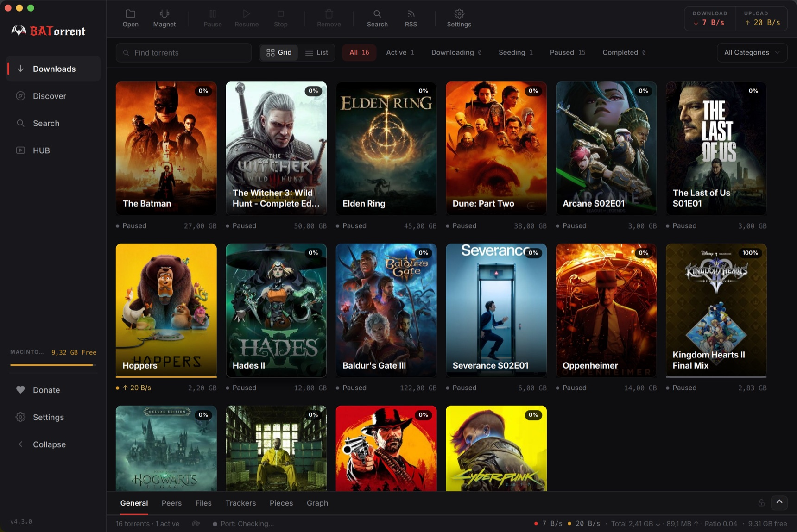

> [!IMPORTANT]
> **Це неофіційний форк.** Перед вами особистий форк [**coex177**](https://github.com/coex177), а не офіційний проєкт. Він стежить за upstream і додає низку виправлень та поліпшень зручності (див. [Чим відрізняється цей форк](#чим-відрізняється-цей-форк)). Він не пов'язаний з автором оригіналу й не підтримується та не схвалюється ним.
>
> - **Оригінальний проєкт:** [BATorrent-app/BATorrent](https://github.com/BATorrent-app/BATorrent) від Mateus Cruz. Використовуйте його для офіційних, кросплатформних, підписаних збірок (Microsoft Store / Homebrew / AppImage).
> - **Збірки цього форку:** [релізи coex177/BATorrent](https://github.com/coex177/BATorrent/releases), наразі це **альфа лише для Windows** (`v4.1.0a`).

<p align="center">
  <a href="README.md">English</a> | <a href="README.pt-BR.md">Português</a> | <a href="README.zh-CN.md">中文</a> | <a href="README.ja.md">日本語</a> | <a href="README.ru.md">Русский</a> | <a href="README.es.md">Español</a> | <a href="README.de.md">Deutsch</a> | <b>Українська</b>
</p>

<p align="center">
  
</p>

<h1 align="center">BATorrent</h1>

<p align="center">
  <i>Торент-клієнт з обличчям — обкладинки фільмів, шість тем, нуль реклами.</i>
</p>

<p align="center">
  <a href="https://github.com/coex177/BATorrent/releases"></a>
  <a href="https://github.com/coex177/BATorrent/releases"></a>
  <a href="LICENSE"></a>
  
</p>


<p align="center">
  
</p>

Більшість торент-клієнтів виглядають як податкова декларація. Цей показує ваші завантаження як **стіну обкладинок фільмів, серіалів та ігор** — те саме, що ви впізнаєте в Netflix чи Steam — і дозволяє вдягнути його в шість тем (або власні шпалери). Під капотом — перевірений рушій **libtorrent**, тож це не гарненька іграшка: це справжній клієнт, який просто має смак.

> **Без реклами. Без телеметрії. Без «Pro»-версії. Без акаунта.** Єдиний запит, який він робить сам, — це перевірка оновлень на GitHub, і її можна вимкнути. Вихідний код прямо тут — прочитайте [`updater.cpp`](src/services/integrations/updater.cpp) і переконайтеся самі.


## Чим відрізняється цей форк

Цей форк базується на оригінальному BATorrent **v4.1.0** і додає набір виправлень та поліпшень зручності. Усе, що нижче цього розділу, описує оригінальний застосунок і стосується також форку.

- **Перейменування робить усе.** Перейменування торента тепер оновлює файл або теку на диску *і* назву, показану в списку, а стара порожня тека після цього прибирається. Натисніть **F2**, щоб перейменувати; діалог ставить фокус на поле й підтверджується по Enter.
- **Видалення надійне.** Видалення тепер обробляє весь множинний вибір (а не лише останній клікнутий елемент), видаляє теку верхнього рівня з диска, коли ввімкнено «також видалити файли», і надійно видаляє торенти, які ще активно завантажуються, спершу зупиняючи їх.
- **Перероблені налаштування.** Окрема вкладка **Завантаження**; редаговані поля шляхів, що оновлюються після «Огляду»; опція «Переміщувати додані файли `.torrent`» та опція «Видаляти файл `.torrent` після додавання» (замінює стару приховану теку `.processed`); кнопка **Перезапустити** біля піктограми застосунку; і попередження, якщо відстежувана тека може мовчки знову додати щойно видалений торент.
- **Робоче меню в треї на Windows.** Піктограма в системному треї тепер має меню за правим кліком на Windows (Показати, Відкрити торент/магнет, Призупинити/відновити все, Налаштування, Вихід).
- **Полірування.** Діалоги налаштувань і вводу в стилі застосунку, діалог «Про програму» з кнопкою **Закрити** за замовчуванням і вичитка англійських рядків.

> [!NOTE]
> Два відомі обмеження цього форку: збірки наразі **лише для Windows** (офіційні кросплатформні версії надходять з upstream), а вбудований оновлювач і далі перевіряє релізи **оригінального** проєкту, тож він не позначає версії цього форку як оновлення.


## Навіщо це існує

*Розділ нижче — від автора оригіналу, Mateus Cruz:*

Я один розробник із Бразилії. Мені був потрібен торент-клієнт, який серйозно ставиться до приватності, працює нативно на будь-якому десктопі й не виглядає так, ніби його зробили у 2009 році — а оскільки такого не знайшлося, я зробив свій. Він безкоштовний і під **ліцензією MIT**: без підступів, без телеметрії, що прокрадеться згодом, і його не можна тихо продати компанії, яка причепить рекламу. Вісім мов, бо «корисний» не має означати «лише англійською».

## Як це виглядає

<p align="center">
  
</p>

<p align="center">
  
</p>

<p align="center">
  
</p>

<p align="center">
  
</p>

- **Автоматичні обкладинки** — читає назву торента й підтягує справжній постер (фільми та серіали через TMDB, ігри через IGDB) у вигляд-сітку. Один клік перемикає на компактний список.
- **Шість тем** — Dark, Light, Midnight, Sakura, Dark Star і повністю **кастомна** (власний фон + акцентні кольори), кожна з опціональною аніме-графікою акценту.
- Графік швидкості в реальному часі, прогрес із кольором за станом, насичене спливне вікно в треї зі швидкостями та часом, що залишився — деталі, від яких він *відчувається* завершеним.

## Що він реально вміє

| | |
|---|---|
| 🔒 **Приватність передусім** | Прив'язка до VPN-інтерфейсу + **kill switch** (обриває весь трафік, якщо тунель упав), PT-режим для приватних трекерів, пресет Tor, анонімний handshake, блокування «п'явок» (anti-leecher) |
| 🔎 **Знайти та додати** | Вбудований пошук (вкл. відкриті джерела СНД/RuTor, без входу), Розумна вставка (magnet / `.torrent` / `thunder://` / hash по Ctrl+V), авто-завантаження через RSS із regex-фільтрами, drag-and-drop |
| 📱 **Керування звідусіль** | Веб-інтерфейс у браузері з **QR-сполученням** — відскануйте з телефона, без введення IP. QR генерується локально; ваша адреса ніколи не залишає машину |
| 📺 **Дивитися та впорядковувати** | Перегляд під час завантаження, авто-розпакування архівів, категорії + теги, оновлення бібліотеки Plex/Jellyfin/Emby після завершення |
| 🔔 **Бути в курсі** | Нативні сповіщення робочого столу, оповіщення в Telegram, Discord Rich Presence («Завантажується X · 67%») |

<details>
<summary><b>…і довгий хвіст</b> (натисніть, щоб розгорнути)</summary>

Пріоритет за файлами · послідовне завантаження · авто-додавання трекерів · керування розкладкою вмісту · regex виключених файлів · тимчасова тека завантаження · стан «Завершено» з вікнами роздачі · авто-пауза за помилок файлів · глобальні + по-торенту ліміти рейтингу/часу · планувальник смуги пропускання (година + день) · імпорт із qBittorrent · створення `.torrent`-файлів · інспектор торента · списки блокування IP · шифрування протоколу · дзеркало оновлень Gitee · авто-вимкнення після завершення · виняток у Windows Defender · повний бекап/відновлення · історія нещодавно видалених · примусовий запуск · вбудований переглядач логів + діагностика + тест витоку IP · форматування з урахуванням локалі · гарячі клавіші.

</details>


## Рушій

Більшість торент-клієнтів лінкують стандартний libtorrent. BATorrent постачається з невеликим **пропатченим форком**, що дозволяє змінювати поведінку рушія, недосяжну через публічний API:

- **Швидший розгін конвеєра запитів.** На каналі з високою пропускною здатністю та високою затримкою стандартний конвеєр запитів росте по одному кроку; форк нарощує його геометрично й заповнює широкий канал за частку обмінів. У власному A/B-бенчмарку проєкту — близько **+27%** на швидкому каналі, без властивих стандарту провалів між запусками, і він ніколи не деградує.
- **Пріоритет пірів зі своєї країни.** Офлайн-база GeoIP (db-ip Lite) позначає кожен пір за країною, і ранжування пірів у форку за можливості віддає перевагу пірам із вашої країни — це зазвичай означає меншу затримку та менше тротлених транскордонних маршрутів.

Обидві функції — можливості форка часу компіляції (вимкнені у стандартному збиранні); вони застосовуються як версіоновані патчі в [`third_party/patches/`](third_party/patches), а не як вбудована копія.

## Завантажити

**Цей форк** пропонує одну збірку: альфа-інсталятор для Windows.

| | | |
|---|---|---|
| **Цей форк (Windows)** | [Інсталятор `v4.1.0a`](https://github.com/coex177/BATorrent/releases/latest) (`BATorrent-setup-x86_64.exe`). Встановлення для користувача, без прав адміністратора. | Windows 10/11 · x86_64 · **альфа** |

Для **офіційних, підписаних, кросплатформних** збірок використовуйте оригінальний проєкт:

| Платформа | | |
|---|---|---|
| **Windows** | [Microsoft Store](https://apps.microsoft.com/detail/9n4l3tq24rc6) · [Інсталятор](https://github.com/BATorrent-app/BATorrent/releases/latest) · [Портативна версія](https://github.com/BATorrent-app/BATorrent/releases/latest) | Windows 10+ |
| **macOS** | **`brew install --cask Mateuscruz19/batorrent/batorrent`** · [`.dmg`](https://github.com/BATorrent-app/BATorrent/releases/latest) | macOS 12+ · Apple Silicon |
| **Linux** | [AppImage](https://github.com/BATorrent-app/BATorrent/releases/latest) | glibc 2.35+ |

Далі просто перетягніть `.torrent` або magnet у вікно. Ось і все.

<sub>**macOS:** поки без нотаризації (програма розробника Apple платна). Homebrew — найгладший шлях: `brew` знімає прапорець карантину, тож застосунок відкривається без діалогу Gatekeeper. Із `.dmg` уперше — правий клік → **Відкрити**.</sub>


<details>
<summary><b>Збірка з джерел та інженерні нотатки</b></summary>

### Вимоги
C++17 · CMake 3.16+ · Qt 6 (`Widgets`, `Network`, `Svg`, `Multimedia`) · libtorrent-rasterbar 2.0+ · Boost · Qt6Keychain (опціонально).

```bash
# Debian / Ubuntu
sudo apt install build-essential cmake qt6-base-dev qt6-svg-dev qt6-multimedia-dev \
    libtorrent-rasterbar-dev libboost-dev libssl-dev
cmake -B build -DCMAKE_BUILD_TYPE=Release && cmake --build build -j && ./build/BATorrent
```
(macOS: `brew install qt libtorrent-rasterbar boost openssl`. Windows: інсталятор Qt + `vcpkg install libtorrent:x64-windows`.)

### Якість і безпека

<p>
  <a href="https://github.com/BATorrent-app/BATorrent/actions/workflows/codeql.yml"></a>
  <a href="https://github.com/BATorrent-app/BATorrent/actions/workflows/sanitizers.yml"></a>
  <a href="https://sonarcloud.io/summary/new_code?id=Mateuscruz19_BAT-Torrent"></a>
  <a href="https://www.codefactor.io/repository/github/mateuscruz19/batorrent"></a>
  <a href="https://www.bestpractices.dev/projects/13073"></a>
</p>

- **Тести** — набір Catch2 (юніт, безпека, пам'ять) на кожній CI-збірці; нова поведінка бекенду отримує тест.
- **Санітайзери** — проходить чисто під AddressSanitizer + UndefinedBehaviorSanitizer (0 витоків / use-after-free / UB).
- **Перевірка** перед кожним релізом щодо безпеки пам'яті/потоків, автентифікації WebUI, ін'єкцій, path traversal, валідації введення та поводження із секретами. Секрети зберігаються в keychain ОС, ніколи у відкритому вигляді; WebUI відкривається в мережу лише після встановлення пароля.

</details>

## Внесок

Щодо проблем **саме цього форку** відкривайте issue в [coex177/BATorrent](https://github.com/coex177/BATorrent/issues). Щодо оригінального застосунку використовуйте [upstream-репозиторій](https://github.com/BATorrent-app/BATorrent). Звіти про помилки: вкажіть вашу платформу + версію (`Довідка → Про програму`) і кроки відтворення.

## Ліцензія

[MIT](LICENSE) © 2024–2026 Mateus Cruz (автор оригіналу) · зроблено в Бразилії 🦇

Цей форк підтримує [coex177](https://github.com/coex177); він залишається під тією самою ліцензією MIT.
