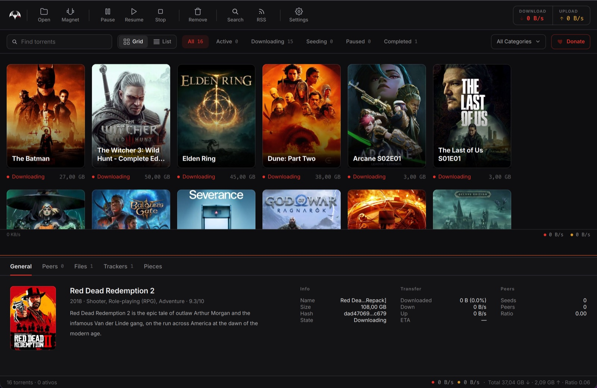
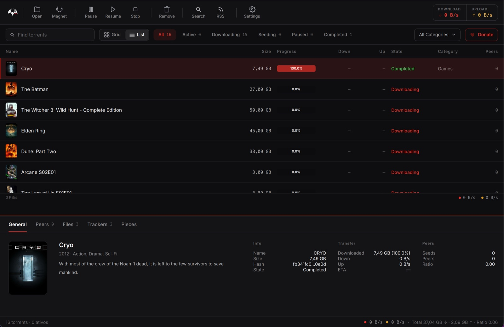
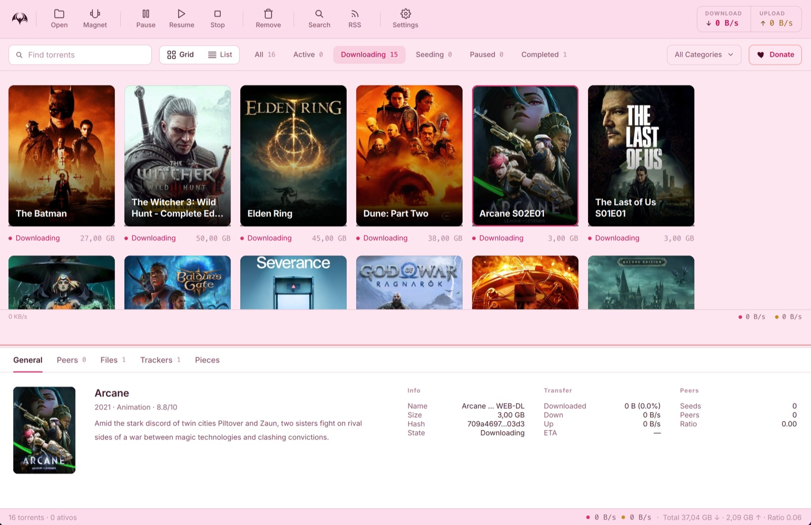

<p align="center">
  <a href="README.md">English</a> | <a href="README.pt-BR.md">Português</a> | <b>中文</b> | <a href="README.ja.md">日本語</a> | <a href="README.ru.md">Русский</a> | <a href="README.es.md">Español</a> | <a href="README.de.md">Deutsch</a> | <a href="README.ua.md">Українська</a>
</p>

<p align="center">
  
</p>

<h1 align="center">BATorrent</h1>

<p align="center">
  <i>有颜值的 BitTorrent 客户端 — 电影封面、六款主题、零广告。</i>
</p>

<p align="center">
  <a href="https://github.com/Mateuscruz19/BATorrent/releases/latest"></a>
  <a href="https://github.com/Mateuscruz19/BATorrent/releases"></a>
  <a href="LICENSE"></a>
  
  <a href="https://apps.microsoft.com/detail/9n4l3tq24rc6"></a>
</p>


<p align="center">
  
</p>

大多数 BT 客户端长得像报税表。这一个把你的下载呈现为 **一墙电影、剧集和游戏封面** — 就像你在 Netflix 或 Steam 上看到的那样 — 还能用六款主题（或你自己的壁纸）来装扮它。底层是久经考验的 **libtorrent** 引擎，所以它不是中看不中用的玩具：而是一个恰好还有点品味的真正客户端。

> **无广告。无遥测。无「Pro」版。无需账号。** 它唯一会自行发起的请求是 GitHub 更新检查，而且可以关闭。源代码就在这里 — 阅读 [`updater.cpp`](src/app/updater.cpp)，自己来验证。


## 为什么会有这个项目

我是巴西的一名独立开发者。我想要一个认真对待隐私、在每个桌面平台上原生运行、而且看起来不像 2009 年做的 BT 客户端 — 既然找不到，我就自己做了一个。它免费且采用 **MIT 许可**：没有附加条件，不会日后偷偷加入遥测，也不会被悄悄卖给一家加塞广告的公司。支持八种语言，因为「好用」不应该意味着「只有英文」。

## 外观

<p align="center">
  
</p>

<p align="center">
  
</p>

<p align="center">
  
  
</p>

- **自动封面** — 它读取种子名称，把真实海报（电影和剧集来自 TMDB，游戏来自 IGDB）拉取到网格视图。一键切换到紧凑列表。
- **六款主题** — Dark、Light、Midnight、Sakura、Dark Star，以及一个完全 **自定义** 的主题（你自己的背景 + 强调色），每款都可选动漫风格的点缀插画。
- 实时速度图、按状态着色的进度、带实时速度和剩余时间的托盘弹窗 — 这些细节让它*感觉*完整。

## 它到底能做什么

| | |
|---|---|
| 🔒 **隐私优先** | 绑定到 VPN 网络接口 + **断网保护（kill switch）**（隧道断开即切断所有流量）、面向私有站（PT）的 PT 模式、Tor 预设、匿名握手、屏蔽迅雷/QQ 等吸血客户端 |
| 🔎 **查找与添加** | 内置搜索（含开放的 CIS/RuTor 源，无需登录）、智能粘贴（Ctrl+V 识别 magnet / `thunder://` / 哈希）、带正则过滤的 RSS 自动下载、拖放 |
| 📱 **随处掌控** | 浏览器 WebUI + **二维码配对** — 用手机扫一扫，无需手输 IP。二维码在本地生成，你的地址绝不离开本机 |
| 📺 **观看与整理** | 边下边播、自动解压压缩包、分类 + 标签、完成时刷新 Plex/Jellyfin/Emby 媒体库 |
| 🔔 **保持知情** | 原生桌面通知、Telegram 提醒、Discord Rich Presence（「正在下载 X · 67%」） |

<details>
<summary><b>……以及长尾功能</b>（点击展开）</summary>

单文件优先级 · 顺序下载 · 自动注入 Tracker · 内容布局控制 · 排除文件正则 · 临时下载目录 · 带做种时长窗口的「已完成」状态 · 文件出错时自动暂停 · 全局 + 单种子的分享率/时间限制 · 带宽计划（按小时 + 按星期）· 从 qBittorrent 导入 · 创建 `.torrent` 文件 · 种子检查器 · IP 屏蔽列表 · 协议加密 · Gitee 更新镜像 · 完成后自动关机 · Windows Defender 排除 · 完整备份/恢复 · 最近删除历史 · 强制开始 · 内置日志查看器 + 诊断 + IP 泄漏测试 · 按区域设置格式化 · 键盘快捷键。

</details>


## 获取

| 平台 | | |
|---|---|---|
| **Windows** | [Microsoft Store](https://apps.microsoft.com/detail/9n4l3tq24rc6) · [安装版](https://github.com/Mateuscruz19/BATorrent/releases/latest) · [便携版](https://github.com/Mateuscruz19/BATorrent/releases/latest) | Windows 10+ |
| **macOS** | **`brew install --cask Mateuscruz19/batorrent/batorrent`** · [`.dmg`](https://github.com/Mateuscruz19/BATorrent/releases/latest) | macOS 12+ · Apple Silicon |
| **Linux** | [AppImage](https://github.com/Mateuscruz19/BATorrent/releases/latest) | glibc 2.35+ |

然后把 `.torrent` 文件或 magnet 链接拖到窗口里就行。就这么简单。

<sub>**macOS：** 尚未进行公证（Apple 的开发者计划需付费）。Homebrew 最省心 — `brew` 会移除隔离标记，应用直接打开，不会弹 Gatekeeper 提示。若用 `.dmg`，首次请右键 → **打开**。</sub>


<details>
<summary><b>从源码构建与工程说明</b></summary>

### 依赖
C++17 · CMake 3.16+ · Qt 6（`Widgets`、`Network`、`Svg`、`Multimedia`）· libtorrent-rasterbar 2.0+ · Boost · Qt6Keychain（可选）。

```bash
# Debian / Ubuntu
sudo apt install build-essential cmake qt6-base-dev qt6-svg-dev qt6-multimedia-dev \
    libtorrent-rasterbar-dev libboost-dev libssl-dev
cmake -B build -DCMAKE_BUILD_TYPE=Release && cmake --build build -j && ./build/BATorrent
```
（macOS：`brew install qt libtorrent-rasterbar boost openssl`。Windows：Qt 安装器 + `vcpkg install libtorrent:x64-windows`。）

### 质量与安全

<p>
  <a href="https://github.com/Mateuscruz19/BATorrent/actions/workflows/codeql.yml"></a>
  <a href="https://github.com/Mateuscruz19/BATorrent/actions/workflows/sanitizers.yml"></a>
  <a href="https://sonarcloud.io/summary/new_code?id=Mateuscruz19_BAT-Torrent"></a>
  <a href="https://www.codefactor.io/repository/github/mateuscruz19/batorrent"></a>
  <a href="https://www.bestpractices.dev/projects/13073"></a>
</p>

- **测试** — 每次 CI 构建都运行 Catch2 测试套件（单元、安全、内存）；新的后端行为都会配测试。
- **Sanitizers** — 在 AddressSanitizer + UndefinedBehaviorSanitizer 下干净通过（0 泄漏 / use-after-free / UB）。
- **审查** — 每次发布前都会检查内存/线程安全、WebUI 鉴权、注入、路径穿越、输入校验和密钥处理。密钥保存在系统钥匙串中，绝不明文存储；只有在你设置密码后，WebUI 才会对网络开放。

</details>

## 参与贡献

欢迎提交 Issue 和 PR — 非琐碎的改动请先开 Issue。报告 Bug 时请附上你的平台 + 版本（`帮助 → 关于`）和复现步骤。尤其欢迎翻译。

## 许可证

[MIT](LICENSE) © 2024–2026 Mateus Cruz · 于巴西制作 🦇
